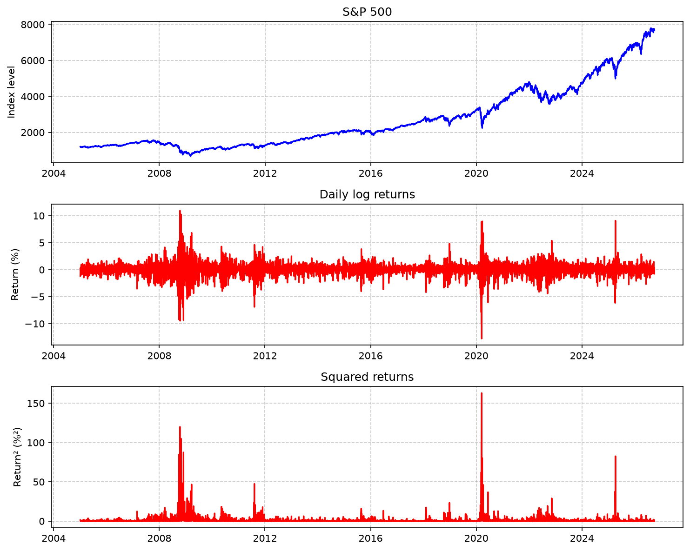
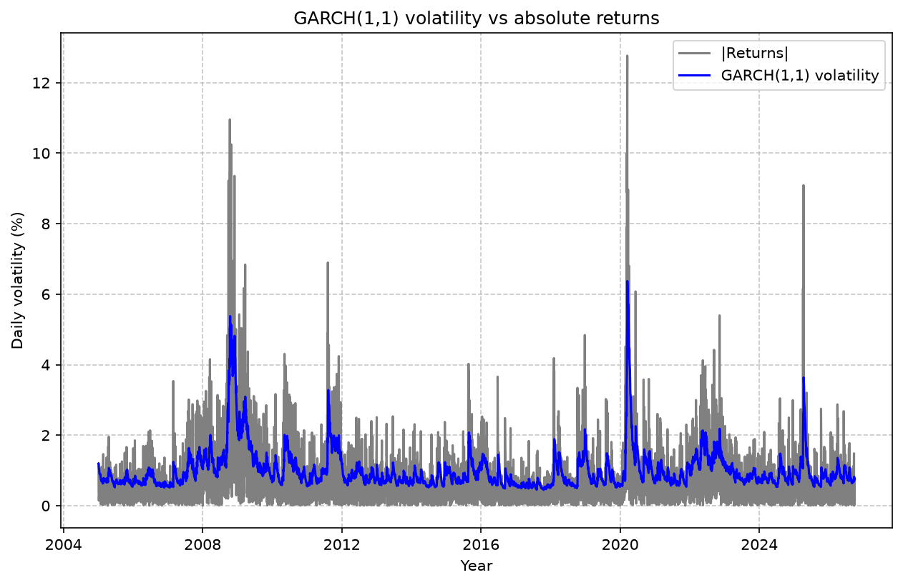
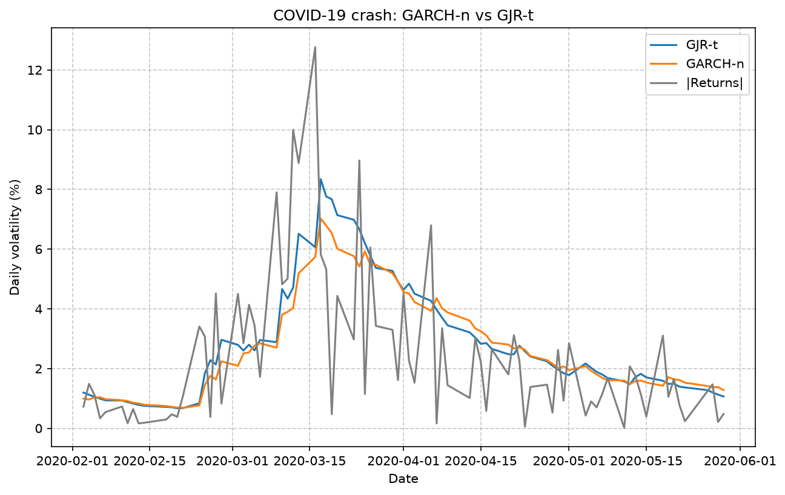
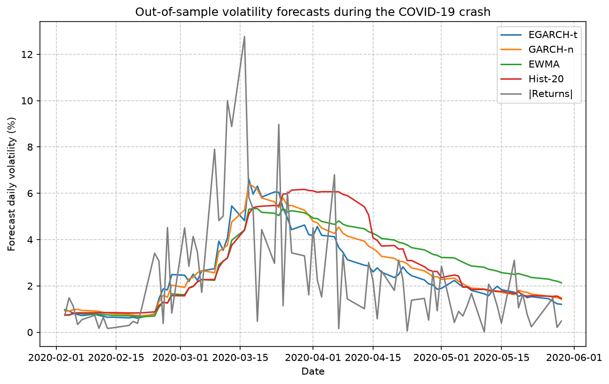
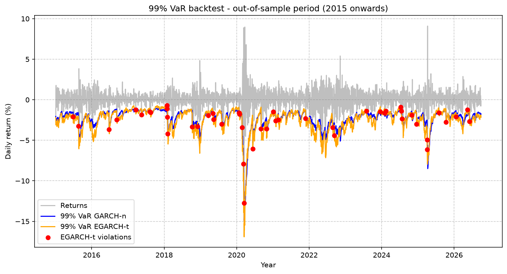

# Volatility Forecasting & Market Risk on the S&P 500
### GARCH · GJR · EGARCH · Value-at-Risk · Expected Shortfall · Backtesting

A Python project that models the daily volatility of the S&P 500 with the GARCH family, turns volatility forecasts into **99 % Value-at-Risk** and **97.5 % Expected Shortfall**, and evaluates them **out of sample** with the **Kupiec** and **Christoffersen** backtests.

The GARCH(1,1) filter and its maximum-likelihood estimation are first **coded from scratch** (NumPy / SciPy), then cross-checked against the reference library [`arch`](https://github.com/bashtage/arch).

---

## Key findings

- **Volatility clustering is statistically proven** on the S&P 500: the GARCH reaction (α) and persistence (β) parameters are significant with p-values far below 0.001.
- **Fat tails and asymmetry matter.** Switching from a normal to a Student-t distribution improves the log-likelihood by **+161 points**, and adding a leverage term by **+102 points**, both for a single extra parameter. Negative shocks drive volatility much more than positive ones.
- **Out of sample (2015–2026), GARCH models beat simple benchmarks** (EWMA / RiskMetrics and 20-day historical volatility) on the QLIKE loss. However, the large in-sample advantage of EGARCH-t over a plain GARCH(1,1) almost vanishes out of sample.
- **No model passes the conditional coverage backtest at 5 %.** The best one, **EGARCH-t**, records 48 violations of the 99 % VaR versus 29.5 expected, and underestimates the average loss beyond the VaR by about 8 %.

---

## Methodology

| Step | Content |
|---|---|
| 1. Data | S&P 500 (`^GSPC`, Yahoo Finance), Jan 2005 – Sep 2026, daily log returns in % |
| 2. GARCH(1,1) by hand | Recursive variance filter σ²ₜ = ω + α·ε²ₜ₋₁ + β·σ²ₜ₋₁, persistence, long-run variance, half-life of a shock |
| 3. Maximum likelihood | Gaussian log-likelihood optimised with `scipy.optimize` (SLSQP, stationarity constraint α + β < 1), validated against `arch` |
| 4. Model selection | GARCH, GJR-GARCH and EGARCH × normal / Student-t, compared with AIC and BIC |
| 5. Out-of-sample forecasts | Estimation on 2005–2014, one-day-ahead forecasts on 2015–2026, evaluated with MSE, QLIKE and a calibration ratio against EWMA (λ = 0.94) and 20-day historical volatility |
| 6. Risk measures | Parametric 99 % VaR and 97.5 % Expected Shortfall (standardised Student-t quantiles, ES by Monte Carlo simulation) |
| 7. Backtesting | Kupiec unconditional coverage test, Christoffersen independence and conditional coverage tests |

---

## Results

### 1. Stylised facts

| Mean (daily) | Std. dev. (daily) | Annualised vol. | Skewness | Excess kurtosis |
|---|---|---|---|---|
| 0.034 % | 1.20 % | 19.0 % | −0.48 | 13.3 |

Returns are far from normal: losses are larger than gains (negative skewness) and extreme days are much more frequent than under a normal distribution (excess kurtosis of 13).



### 2. GARCH(1,1) estimated by hand

| | ω | α | β | α + β | Half-life | Long-run vol. |
|---|---|---|---|---|---|---|
| Own MLE (SciPy) | 0.029 | 0.128 | 0.847 | 0.975 | 28 days | 17.1 % |
| `arch` library | 0.029 | 0.130 | 0.845 | 0.975 | | |



### 3. Model comparison (full sample)

| Model | Parameters | Log-likelihood | AIC | BIC |
|---|---|---|---|---|
| **EGARCH-t** | 6 | **−6 994.5** | **14 000.9** | **14 040.6** |
| GJR-t | 6 | −7 008.2 | 14 028.3 | 14 067.9 |
| GARCH-t | 5 | −7 106.0 | 14 222.1 | 14 255.1 |
| EGARCH-n | 5 | −7 159.8 | 14 329.5 | 14 362.6 |
| GJR-n | 5 | −7 165.9 | 14 341.8 | 14 374.9 |
| GARCH-n | 4 | −7 267.5 | 14 543.1 | 14 569.5 |

In asymmetric models, the reaction to positive shocks (α) is close to zero: during the COVID-19 crash, the +9 % rally of 24 March 2020 raised the GARCH-n volatility, but not the GJR-t volatility.



### 4. Out-of-sample volatility forecasts (2015 – 2026)

Parameters estimated on 2005–2014 only, to avoid look-ahead bias.

| Model | QLIKE ↓ | MSE ↓ | Calibration ratio (target 1) |
|---|---|---|---|
| **EGARCH-t** | **0.750** | **19.7** | 1.05 |
| GARCH-n | 0.751 | 20.8 | 0.98 |
| EWMA (λ = 0.94) | 0.814 | 22.7 | 1.13 |
| Historical 20 days | 0.897 | 24.6 | 1.31 |



### 5. Value-at-Risk and Expected Shortfall

**99 % VaR:** about 2 950 test days, so **29.5 violations expected**.

| Model | Violations | Rate | 97.5 % VaR rate (target 2.5 %) |
|---|---|---|---|
| **EGARCH-t** | **48** | **1.62 %** | **2.81 %** |
| GARCH-n | 59 | 2.00 % | 3.15 % |
| EWMA | 65 | 2.20 % | 3.66 % |
| Historical 20 days | 77 | 2.61 % | 4.10 % |

**97.5 % Expected Shortfall** (average loss on the days the 97.5 % VaR is breached):

| Model | Actual mean loss | Forecast ES | Underestimation |
|---|---|---|---|
| GARCH-n | 2.76 % | 2.33 % | −15 % |
| EGARCH-t | 2.72 % | 2.52 % | −8 % |

At 97.5 %, the normal and Student-t distributions give almost the same quantile (−1.96 vs −2.00), but very different Expected Shortfalls (−2.34 vs −2.65). This is why regulators (Basel III / FRTB) moved from VaR to ES: VaR says where the tail starts, ES measures how severe it is.



### 6. Backtesting (99 % VaR)

| Model | LR_uc (Kupiec) | p-value | π₀₁ | π₁₁ | LR_ind | p-value | LR_cc | p-value | Verdict |
|---|---|---|---|---|---|---|---|---|---|
| **EGARCH-t** | 9.80 | 0.002 | 1.5 % | 6.3 % | 3.85 | 0.050 | 13.66 | 0.001 | Rejected |
| GARCH-n | 23.01 | < 0.001 | 1.9 % | 8.5 % | 7.33 | 0.007 | 30.34 | < 0.001 | Rejected |
| EWMA | 32.04 | < 0.001 | 2.1 % | 7.7 % | 5.79 | 0.016 | 37.82 | < 0.001 | Rejected |
| Historical 20 days | 53.40 | < 0.001 | 2.5 % | 7.8 % | 5.59 | 0.018 | 58.99 | < 0.001 | Rejected |

π₀₁ is the probability of a violation after a normal day, π₁₁ after a violation. For every model, a violation today makes a violation tomorrow **3 to 4.5 times more likely**: the models react too slowly at the start of a crisis.

---

## Conclusion and limitations

The EGARCH model with Student-t innovations is the closest to a valid VaR model: it has the best out-of-sample QLIKE and the best conditional coverage statistic, and it is borderline on the independence test (p = 0.05). It is nevertheless rejected at the 5 % level, mainly because of its coverage: 48 violations of the 99 % VaR versus 29.5 expected, and an 8 % underestimation of the average loss beyond the VaR.

## Next steps

- **Re-estimate the parameters regularly** (e.g. monthly, on an expanding window) instead of freezing them at the end of 2014, so that the model learns from the 2018, 2020 and 2022 episodes.
- **Use a longer history** (e.g. from 1987) to include more extreme events in the estimation.
- **Use a skewed Student-t distribution** (`dist='skewt'`) to capture the heavier left tail.
- Test whether the forecast differences between models are significant (**Diebold-Mariano test**).

---

## How to run

```bash
git clone https://github.com/NathanMLD/garch-var-sp500.git
cd garch-var-sp500
pip install -r requirements.txt
python Garch.py
```

Figures are saved in `figures/`. Data are downloaded from Yahoo Finance at run time.

## Project structure

```
garch-var-sp500/
├── Garch.py           # full pipeline: data, GARCH, MLE, model comparison, forecasts, VaR/ES, backtests
├── requirements.txt
├── figures/           # generated charts
└── README.md
```

## References

- Engle, R. (1982). Autoregressive Conditional Heteroscedasticity. *Econometrica*.
- Bollerslev, T. (1986). Generalized Autoregressive Conditional Heteroskedasticity. *Journal of Econometrics*.
- Nelson, D. (1991). Conditional Heteroskedasticity in Asset Returns: A New Approach. *Econometrica*.
- Glosten, L., Jagannathan, R. & Runkle, D. (1993). On the Relation between the Expected Value and the Volatility of the Nominal Excess Return on Stocks. *Journal of Finance*.
- Kupiec, P. (1995). Techniques for Verifying the Accuracy of Risk Measurement Models. *Journal of Derivatives*.
- Christoffersen, P. (1998). Evaluating Interval Forecasts. *International Economic Review*.
- Hansen, P. & Lunde, A. (2005). A Forecast Comparison of Volatility Models: Does Anything Beat a GARCH(1,1)? *Journal of Applied Econometrics*.
- Patton, A. (2011). Volatility Forecast Comparison Using Imperfect Volatility Proxies. *Journal of Econometrics*.
